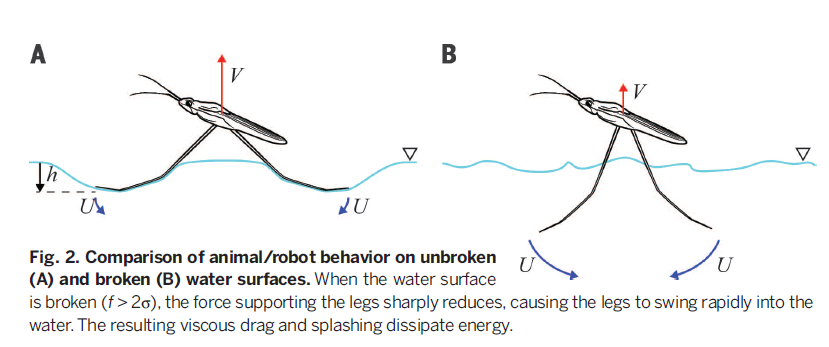
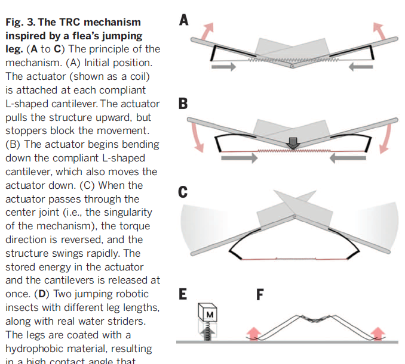
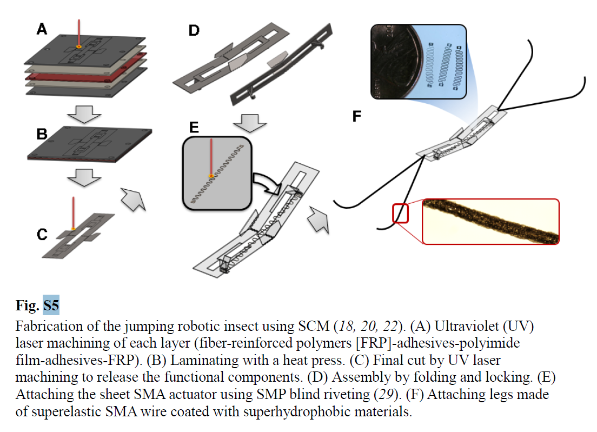

# TinyRobot
TinyRobot summary of TheScience  
[TOC]

### [M01] Water Strider 机器水黾
https://science.sciencemag.org/content/349/6247/517  
year: 2015
#### Abstract: 
1. 利用superhydrophobic材料依靠水面张力弹跳；  
2. 加热SMA(形状记忆合金)产生形变弹力驱动

  
  

#### abbrev
* SMA: shape memory alloy 形状记忆合金
* SCM: smart composite microstructures
* GFRP: glass fiber reinforced plate
* TRC: torque reversal catapult 转矩逆转弹射器

#### Key word
* Passive Trigger
  * Experiments were performed on a range of passive trigger specimens to determine the relationship between pulling force and deflection (Fig. S6C).
  * Using the model, we can design the triggering force of the passive trigger when it attains the required deflection for triggering.

* Stiffness of the Sheet SMA Actuator
  * Finally, the stiffness of the actuator, *k*, can be calculated by dividing the triggering force by actuator stroke: ...
  * By varying the design of the passive trigger, various robot prototypes with different actuator stiffnesses were prepared. Table S2 lists their driving forces.

* Fabrication and Materials
  * The robot structure was designed so that the smart composite microstructures (SCM) manufacturing process could be applied (24).
  * Fabrication of the jumping robotic insect using SCM (Fig. S5).  
    
  <!--  -->

* The TRC mechanism
  * The robot was untethered but **triggered by external heat**. The heating wire (Ni-Cr wire) protruded 1 mm from the free surface, and the actuator was positioned right above the heating wire when the robot was put on the free surface. The actuator was heated by thermal convection around the heating wire until the torque direction reversed.
  * When **heated** above its transition temperature, the actuator’s stiffness changes, inducing a negative strain and pulling the passive trigger in the body structure until the torque direction is reversed (Fig. 3, A to C).
  * A thin **heating wire** was carefully placed just below the robot body to activate the SMA actuator. As the SMA actuator transitions, the force increases, and the passive trigger begins to bend (Fig. 3, A to C).When the actuator passes through the center joint, the torque direction changes, and the body structure folds downward, generating a rapid snap-through.

---

### [M04] Electrostatic footpads insect-scale soft robots 机器小强软体机器人
https://robotics.sciencemag.org/content/6/55/eabe7906  
year: 2021

#### Abstract:   
1.  
2. 

#### abbrev
* SMA: shape memory alloy 形状记忆合金
* 

#### Key word

